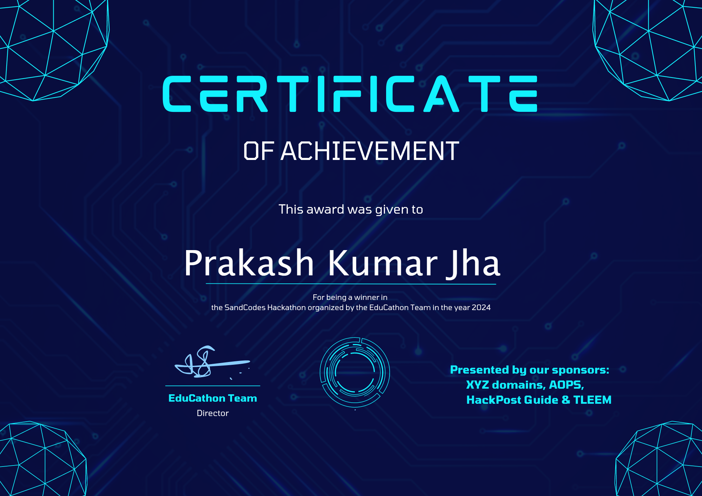

# SpaceTec Console   (WINNER !)
Youtube Video URL : https://youtu.be/ji_zT0MaRiw

SpaceTec Console is a futuristic and sleek navigation app designed to help people in danger. It includes features like a Safe Zone Navigator, Survival Guide, and Community Chat.

Deployement URL : [sandcodesproject-proprak01s-projects.vercel.app](https://sandcodesproject-proprak01s-projects.vercel.app/)

Backend URL: https://temp-server-sandcode.vercel.app

## Features

- **Safe Zone Navigator:** Displays safe zones on a map using Google Maps.
- **Survival Guide:** Provides survival tips for users.
- **Community Chat:** Allows users to chat and share information.
- **LOGIN LOGOUT AUTH:** Allows users to login

## Tech Stack

- **Frontend:**
  - React (Vite)
  - React Router
  - @react-google-maps/api
  -OpenMaps
- **Backend:**
  - Node.js
  - Express.js
  - MongoDB
  - JWT for authentication
 
